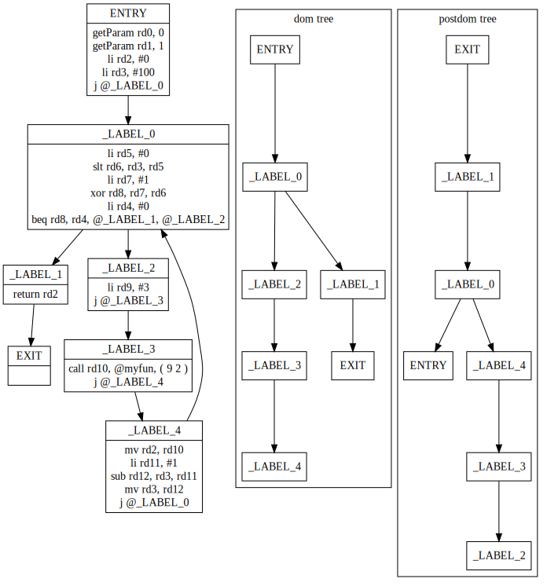
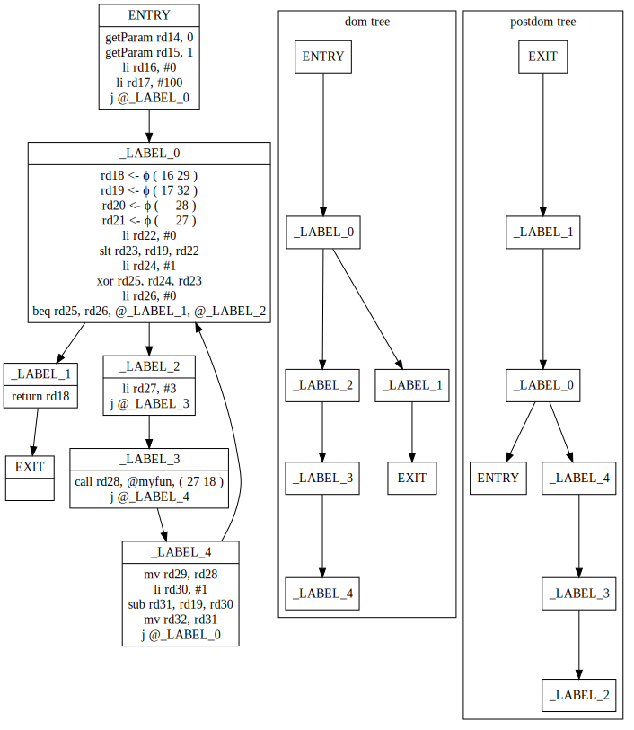
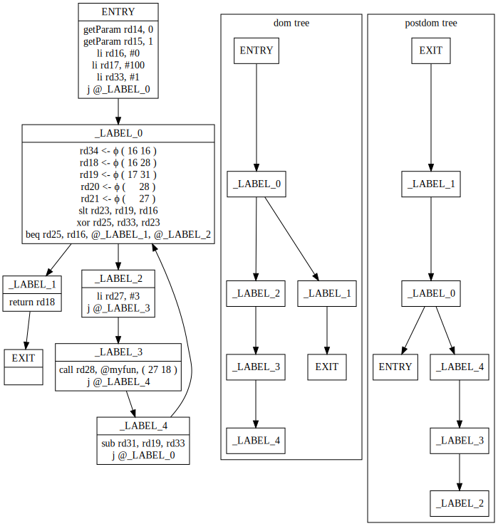
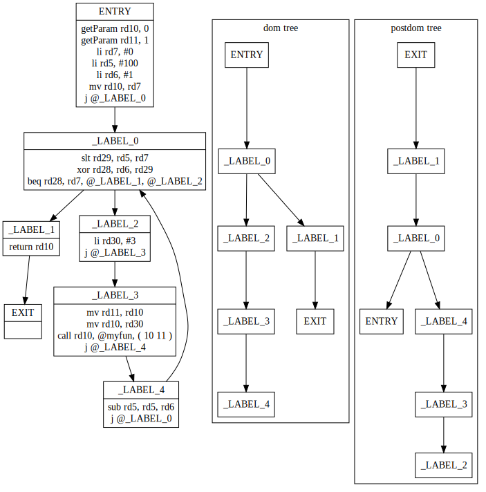

# Rust 🦀 SSA Compiler

A compiler that uses SSA (single static assignment form) as its definitive IR, written entirely in Rust!

The compiler hosts an optimization pipeline and native assembly generation.

## Usage

Show information about available CLI commands:

Display Options:
```sh
$ cargo run -- --help
```

Compile `correct3.lang` into RISCV assembly:
```sh
$ mkdir build
$ cargo run -- examples/correct3.lang -o build
```

Disable optimization:
```sh
$ mkdir build
$ cargo run -- examples/correct3.lang -o build --no-optimize
```

Use the output to generate a rv64 elf:
```sh
$ cargo run --release -- examples/incr-twice.lang examples/incr.lang -o build
$ riscv64-linux-gnu-gcc -mabi=lp64d examples/incr.c build/incrtwice.s build/increment.s build/init.s build/_globals.s -o build/increment.elf
$ qemu-riscv64 build/increment.elf
```

## Roadmap

- [x] Parser (DONE)
- [x] Intermediate Representation (DONE)
    - [x] Definition (DONE)
    - [x] Translation from AST (DONE)
    - [x] CFG construction (DONE)
    - [x] SSA transformation (DONE)
- [x] Optimization passes (DONE)
    - [x] GVN-PRE (DONE)
    - [x] Copy propagation (DONE)
- [x] Backend (DONE)
    - [x] Register allocation (DONE)
    - [x] Instruction selection (DONE)
- [x] Global data (DONE)

## Cargo features

| Feature | Description |
| --- | --- |
| `print-cfgs` | Displays every constructed CFG as a [dot](https://graphviz.org/doc/info/lang.html) graph. |
| `print-gvn` | Displays debug information of the GVN-PRE pass. |
| `print-linear` | Displays generated linear code. |

## Language features

The syntax of the supported language is described in [spec.bnf](./spec.bnf).  
Global functions and global variables have to be forward declared, undefined but declared symbols are left to resolve by the linker.
You can call your functions from C code, see this [example](./examples/incr.c).
The compiler generates optimized riscv64 gnu assembly files, which can then be linked with any other objects.

## Further reading

I go into some implementation details in my [medium article](https://medium.com/@mikn/implementing-ssa-compilers-with-rust-7ef702720bc)!

Viewing the control flow graphs after each step helps one understand and debug the code:

Initial CFG: 
SSA CFG: 
Optimized CFG: 
Register-allocated CFG: 